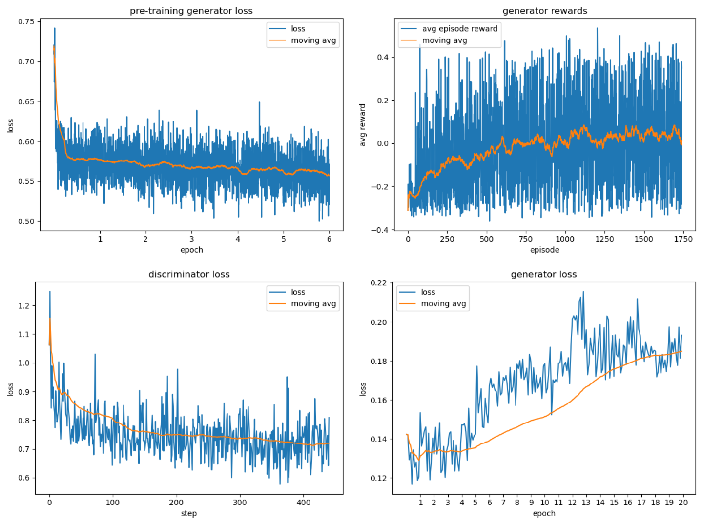

## Overview
Generaive Adversarial Network for Java methods source code synthesis.

This repository is forked from [denizetkar].<br />
Work is inspired by paper *TreeGAN: Syntax-Aware Sequence Generation with Generative Adversarial Networks* [[arxiv]].

## Installation
It's recommended to create new environment. We used Anaconda environment with Python 3.7.
```sh
# anaconda
conda install --file conda_requirements.txt

# pip
pip install -r requirements.txt
```

## Data
We use simplified Java BNF-grammar placed at [data/java/java_lang.bnf](./data/java/java_lang.bnf)<br />
Our dataset is placed at [data/java/text_files](./data/java/text_files). It contains 28245 preprocessed java methods selected from [Funcom dataset].<br />
There is also small dataset placed at [data/java_small/text_files](./data/java_small/text_files) that consists of first 156 methods from original dataset.

## Usage
### Sampling with pretrained model
Simply running [sampling.py](./sampling.py) will produce 10 samples from our pre-trained model ([models/java.model](./models/java.model)).
- to specify number of samples use `--n=<number of samples>`
- to specify chekpoint with pre-trained weights use `--ckpt=<path to checkpoint file>`
```sh
python sampling.py [--n=<number of samples>] [--ckpt=<path to checkpoint file>]
```

### Training
Running [main.py](./main.py) will start training with random initial weights.
- To train model from pre-trained weights use `--pretrained`.<br /> It will load weights from checkpoint [models/java.model](./models/java.model)
- To train model from specific pre-trained weights checkpoint use `--pretrained --ckpt=<path to checkpoint file>`
- If you want to use small dataset for fast training use `--small` 
- To specify path for saving model checkpoint use `--save_dir=<path to directory>`.<br /> It will save `java.model` file into specified directory which must exist.
By default model is saved to [models/java.model](./models/java.model) or file specified in `--ckpt` argument.
- To specify path for saving training stats(losses, rewards) use `--stats=<path to directory>`. <br />
Specified directory must exist. By default stats are saved into [stats](./stats) directory.
```sh
python main.py [--small] [--pretrained [--ckpt=<path to checkpoint file>]] [--save_dir=<path to directory>] [--stats=<path to directory>]
```
## Results
### Samples
Random samples produced by generator after training GAN for 10 epochs:
```java
 public Lock geconchedts () { return ((B2Mepu)null); }
 public Fortind getDefCond() { model.setTou(); tept(); }
 protected int getIcityE(){ synchronized (rodel != image) { seblesserN = namm; retur(); } }
 public void mettingth_inf(TH2MMamem super) { }
 public NumbelitemarT getFimaptaito() {}
 public Proper getBigh() { return lainmetSt; }
 public void isbTypespectio() {}
 public int currameForme() { meturn valu; }
 public void setTimelpir(int s, int oMB) throws M2SYP_W { }
```
### Plots


   [denizetkar]: <https://github.com/denizetkar/TreeGAN>
   [arxiv]: <https://arxiv.org/abs/1808.07582>
   [Funcom dataset]: <http://www.leclair.tech/data/funcom>
